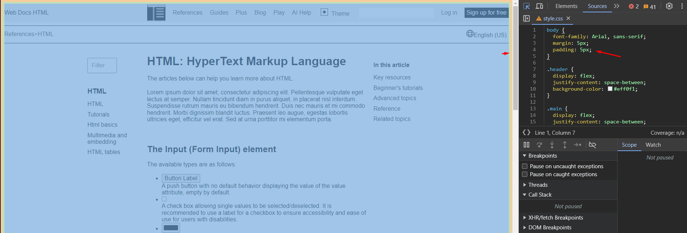
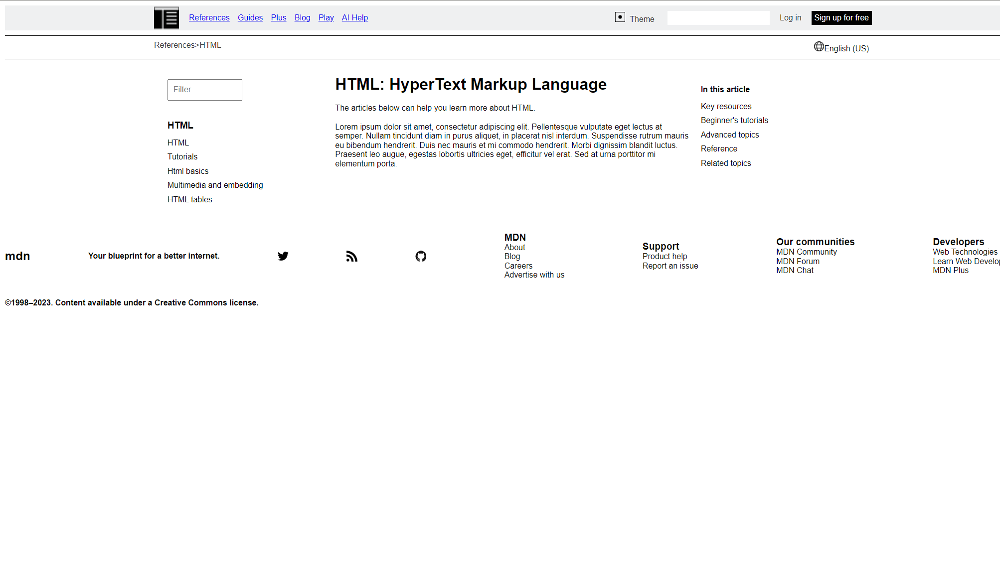

1. Эти отступы тут лишние. 
2. леайут шапки сильно отличается от того что есть (там он ограничен в ширину, навигация "приклеена" к лого)
3. Футер ведет себя не совсем корректно. Он должен быть "приклеен" к низу страницы, когда нет контента, а всё остальное место занимает main секция страницы
4. Давай добавим минимальные цвета, чтобы было проще отличать компоненты (например футер от main контента) 
